  ---
  marp: true
  theme: default
  paginate: true
style: |
  section { font-size: 42px; }
  section h1 { font-size: 2.8em; }
  section h2 { font-size: 2.2em; }
  section h3 { font-size: 1.8em; }
  section p, section li { font-size: 42px; }
  table { font-size: 38px; width: 100%; }
  th, td { padding: 20px 24px; min-width: 80px; font-size: 38px; }
  th { font-size: 40px; }
  section.lead h1 { text-align: center; font-size: 3.2em; }
  section.lead h2 { font-size: 2.4em; }
  section.lead p { font-size: 44px; }
  strong { font-size: 1.05em; }
  ---

  <!-- _class: lead -->

  # 우완 사이드암 투수 가이드
  ## 투심 주무기 + 카운트별 볼배합

  **전제**: 우완 사이드암, **투심이 주무기**  
  투심과 궁합 좋은 구종 → 좌·우타자별 카운트별 볼배합 → **왜 좋은지** 이유

  ---

  ## 1. 투심과 함께 쓰면 효과 좋은 구종

  투심은 **슬라이더·체인지업·커브**와 조합할 때 효과가 큽니다.

  | 구종 | 투심과 잘 맞는 이유 |
  |------|---------------------|
  | **슬라이더** | 릴리스가 같아서 "직구"로 보이다가 바깥쪽으로 퍼지면 타이밍·시선 꼬임. 바깥쪽 낮게 깎기 좋음. |
  | **체인지업** | 속도 차이로 투심 타이밍에 휘둘리기 쉬움. 그립만 바꿔 던지기 편해 제구·볼배합 안정. |
  | **커브** | 각도·속도 차이로 "직구 → 떨어지는 공" 대비. 2S 이후 바깥쪽·땅에 떨어뜨릴 때 유리. |

  **추천**: 투심 + **슬라이더**(필수) + **체인지업** or **커브** 중 1개

  ---

  ## 2. 좌타자 상대 — 기본 전략

  투심 **몸쪽·내각** + 슬라이더 **바깥쪽 낮게** 깎는 패턴이 잘 맞습니다.

  ---

  ### 좌타자 · 타자 유리 (2-0, 3-0, 3-1)

  | 순서 | 구종 | 코스 | 이유 |
  |------|------|------|------|
  | 1 | **투심** | 몸쪽 하단 ~ 무릎 안쪽 | 스트라이크 필수. 제구·신뢰도 가장 높은 투심으로 스트라이크. |
  | 2 | (필요 시) **투심** | 몸쪽 하단 | 같은 구종으로 존 안에 넣기. |

  **볼배합**: 투심 몸쪽 → (필요 시) 투심 몸쪽  
  **왜**: 불리한 카운트에서는 주무기 투심으로 스트라이크 확보가 가장 안전.

  ---

  ### 좌타자 · 첫 구 (0-0, 1-0)

  | 순서 | 구종 | 코스 | 이유 |
  |------|------|------|------|
  | 1 | **투심** | 몸쪽 중간~하단 | 첫 스트라이크. 좌타자 몸쪽 투심은 각도상 압박 큼. |
  | 2 | **슬라이더** or **투심** | 바깥쪽 하단 / 몸쪽 하단 | "직구→옆으로 퍼짐" 대비 or 같은 존 압박. |

  **볼배합**: 투심 몸쪽 → 슬라이더 바깥쪽 낮게  
  **왜**: 스트라이크 하나만 잡아도 유리. 투심으로 시작 후 슬라이더로 바깥쪽 보여주기.

  ---

  ### 좌타자 · 균형 (0-1, 1-1)

  | 순서 | 구종 | 코스 | 이유 |
  |------|------|------|------|
  | 1 | **투심** | 몸쪽·가슴 높이 or 무릎 안쪽 | 스트라이크 존 압박. 몸쪽 높은 공 = 타이밍 깨기. |
  | 2 | **슬라이더** | 바깥쪽 하단 | 몸쪽 다음 바깥쪽 낮게 → 시선·타이밍 이탈. |
  | 3 | **투심** or **체인지업** | 몸쪽 하단 | 땅볼·더블플레이 or 속도 차이 헛스윙. |

  **볼배합**: 투심 몸쪽 → 슬라이더 바깥쪽 → 투심/체인지업  
  **왜**: "몸쪽 직구 → 바깥쪽 변화구"가 사이드암 기본. 한쪽만 보기 어렵게.

  ---

  ### 좌타자 · 투수 유리 (0-2, 1-2, 2-2)

  | 순서 | 구종 | 코스 | 이유 |
  |------|------|------|------|
  | 1 | **슬라이더** | 바깥쪽 바깥, 무릎 밖 | "퍼진 공"으로 헛스윙 유도. |
  | 2 | (참으면) **투심** | 어깨 위 or 몸쪽 하단 | 높은 공 타이밍 깨기 or 땅볼. |
  | 3 | **체인지업** or **커브** | 바깥쪽 낮게 | 직구 타이밍에 스윙 유도. |

  **볼배합**: 슬라이더 바깥 오프 → 투심 하이/몸쪽  
  **왜**: 2S에서는 존 밖 슬라이더 헛스윙이 목표. 이어서 투심·체인지업으로 타이밍 흔들기.

  ---

  ### 좌타자 · 풀카운트 (3-2)

  | 구종 | 코스 | 이유 |
  |------|------|------|
  | **투심** (추천) or **슬라이더** | 몸쪽 하단 / 바깥쪽 하단(스트라이크) | 3-2는 볼이면 출루. 제구 잘 되는 투심으로 스트라이크. |

  **볼배합**: 투심 몸쪽 하단  
  **왜**: 풀카운트는 "스트라이크 넣기" 최우선. 주무기 투심이 가장 안정적.

  ---

  ## 3. 우타자 상대 — 기본 전략

  투심·슬라이더 **바깥쪽 하단** 중심 + 가끔 **몸쪽 투심**으로 인사이드 찌르기.

  ---

  ### 우타자 · 타자 유리 (2-0, 3-0, 3-1)

  | 구종 | 코스 | 이유 |
  |------|------|------|
  | **투심** | 바깥쪽 코너, 무릎~하단 | 스트라이크 확보. 바깥쪽 투심 = "들어오다 움직이는 공"으로 스윙 유도. |

  **볼배합**: 투심 바깥쪽 하단  
  **왜**: 불리한 카운트에서는 투심으로 스트라이크. 우타자에게 땅볼·약한 타구 많음.

  ---

  ### 우타자 · 첫 구 (0-0, 1-0)

  | 순서 | 구종 | 코스 | 이유 |
  |------|------|------|------|
  | 1 | **투심** | 바깥쪽·무릎 높이 | 첫 스트라이크. 사이드암 투심 바깥쪽 각도 자연스러움. |
  | 2 | **슬라이더** or **투심** | 바깥쪽 하단 / 인사이드 | 바깥쪽 깎기 or "바깥→몸쪽" 대비. |

  **볼배합**: 투심 바깥쪽 → 슬라이더 바깥쪽 낮게  
  **왜**: 투심 스트라이크 후 슬라이더로 "직구→퍼짐" 대비.

  ---

  ### 우타자 · 균형 (0-1, 1-1)

  | 순서 | 구종 | 코스 | 이유 |
  |------|------|------|------|
  | 1 | **투심** | 바깥쪽 or 몸쪽 하단 | 땅볼 / "바깥만 던진다" 예상 깨기. |
  | 2 | **슬라이더** | 바깥쪽 하단, 바깥으로 깎기 | 투심 다음 퍼지면 우타자 핵심 헛스윙 구간. |
  | 3 | **투심** or **체인지업** | 바깥쪽 하단 / 몸쪽 낮게 | 연속 땅볼 or 속도 차이. |

  **볼배합**: 투심 바깥 → 슬라이더 바깥 오프 → 투심/체인지업  
  **왜**: "투심(바깥) → 슬라이더(더 퍼짐)"가 우타자 기본. 같은 바깥쪽인데 움직임·속도 달라 판단 어려움.

  ---

  ### 우타자 · 투수 유리 (0-2, 1-2, 2-2)

  | 순서 | 구종 | 코스 | 이유 |
  |------|------|------|------|
  | 1 | **슬라이더** | 바깥쪽 바깥, 무릎 밖 | 우타자에게 바깥쪽 퍼진 슬라이더 = 헛스윙 최다. 직구로 보이다가 퍼짐. |
  | 2 | **투심** | 어깨 위 or 몸쪽 | 높은 공 타이밍 깨기 or 땅볼. |
  | 3 | **체인지업** or **커브** | 바깥쪽 낮게 | 직구 타이밍에 느린 공. |

  **볼배합**: 슬라이더 바깥 오프 → 투심 하이  
  **왜**: 2S에서 "존 밖 슬라이더 헛스윙"이 가장 효율적.

  ---

  ### 우타자 · 풀카운트 (3-2)

  | 구종 | 코스 | 이유 |
  |------|------|------|
  | **투심** (추천) or **슬라이더** | 바깥쪽 하단(스트라이크) | 볼이면 출루. 제구 잘 되는 투심으로 스트라이크. |

  **볼배합**: 투심 바깥쪽 하단(스트라이크 존)  
  **왜**: 3-2에서도 스트라이크 넣기가 우선. 투심 바깥쪽 하단이 가장 안전.

  ---

## 4. 카운트별 선택지 — 모든 카운트 별개, 2~3갈래

**좌타자 · 카운트 하나마다 이 구종 중에서 고르기**

```mermaid
flowchart TB
  C00["0-0"] --> C00A[투심 몸쪽 중하단]
  C00 --> C00B[투심 몸쪽 하단]
  C00 --> C00C[투심 무릎 안쪽]

  C10["1-0"] --> C10A[슬라이더 바깥쪽 낮게]
  C10 --> C10B[투심 몸쪽 하단]
  C10 --> C10C[투심 몸쪽 중간]

  C01["0-1"] --> C01A[투심 몸쪽 가슴 높이]
  C01 --> C01B[투심 무릎 안쪽]
  C01 --> C01C[투심 몸쪽 중간]

  C11["1-1"] --> C11A[투심 몸쪽 하단]
  C11 --> C11B[체인지업 몸쪽 하단]
  C11 --> C11C[슬라이더 바깥쪽 하단]

  C02["0-2"] --> C02A[슬라이더 바깥 오프]
  C02 --> C02B[투심 어깨 위]
  C02 --> C02C[투심 몸쪽 하단]

  C12["1-2"] --> C12A[투심 어깨 위]
  C12 --> C12B[투심 몸쪽 하단]
  C12 --> C12C[체인지업 바깥 낮게]

  C20["2-0"] --> C20A[투심 몸쪽 하단]
  C20 --> C20B[투심 무릎 안쪽]
  C20 --> C20C[투심 몸쪽 중간]

  C21["2-1"] --> C21A[투심 몸쪽 하단]
  C21 --> C21B[체인지업 몸쪽 하단]
  C21 --> C21C[슬라이더 바깥쪽 하단]

  C22["2-2"] --> C22A[투심 어깨 위]
  C22 --> C22B[체인지업 바깥 낮게]
  C22 --> C22C[커브 바깥 낮게]

  C30["3-0"] --> C30A[투심 몸쪽 하단]
  C30 --> C30B[투심 무릎 안쪽]
  C30 --> C30C[투심 몸쪽 중간]

  C31["3-1"] --> C31A[투심 몸쪽 하단]
  C31 --> C31B[투심 무릎 안쪽]
  C31 --> C31C[투심 몸쪽 중간]

  C32["3-2"] --> C32A[투심 몸쪽 하단]
  C32 --> C32B[슬라이더 바깥쪽 하단]
  C32 --> C32C[체인지업 몸쪽 하단]
```

**우타자 · 카운트 하나마다 이 구종 중에서 고르기**

```mermaid
flowchart TB
  D00["0-0"] --> D00A[투심 바깥쪽 무릎]
  D00 --> D00B[투심 바깥쪽 하단]
  D00 --> D00C[투심 바깥 코너]

  D10["1-0"] --> D10A[슬라이더 바깥쪽 낮게]
  D10 --> D10B[투심 인사이드]
  D10 --> D10C[투심 바깥쪽 하단]

  D01["0-1"] --> D01A[투심 바깥쪽 하단]
  D01 --> D01B[투심 몸쪽 하단]
  D01 --> D01C[투심 바깥 무릎]

  D11["1-1"] --> D11A[투심 바깥쪽 하단]
  D11 --> D11B[체인지업 몸쪽 낮게]
  D11 --> D11C[슬라이더 바깥쪽 하단]

  D02["0-2"] --> D02A[슬라이더 바깥 오프]
  D02 --> D02B[투심 어깨 위]
  D02 --> D02C[투심 몸쪽]

  D12["1-2"] --> D12A[투심 어깨 위]
  D12 --> D12B[투심 몸쪽]
  D12 --> D12C[체인지업 바깥 낮게]

  D20["2-0"] --> D20A[투심 바깥쪽 하단]
  D20 --> D20B[투심 바깥 코너]
  D20 --> D20C[투심 무릎~하단]

  D21["2-1"] --> D21A[투심 바깥쪽 하단]
  D21 --> D21B[체인지업 몸쪽 낮게]
  D21 --> D21C[슬라이더 바깥쪽 하단]

  D22["2-2"] --> D22A[투심 어깨 위]
  D22 --> D22B[체인지업 바깥 낮게]
  D22 --> D22C[커브 바깥 낮게]

  D30["3-0"] --> D30A[투심 바깥쪽 하단]
  D30 --> D30B[투심 바깥 코너]
  D30 --> D30C[투심 무릎~하단]

  D31["3-1"] --> D31A[투심 바깥쪽 하단]
  D31 --> D31B[투심 바깥 코너]
  D31 --> D31C[투심 무릎~하단]

  D32["3-2"] --> D32A[투심 바깥쪽 하단]
  D32 --> D32B[슬라이더 바깥쪽 하단]
  D32 --> D32C[체인지업 몸쪽 낮게]
```

  ---

  ## 5. 코스(존) 한눈에

  | 코스 | 용도 |
  |------|------|
  | **몸쪽 하단** | 좌타자 투심 압박, 땅볼, 더블플레이 |
  | **바깥쪽 하단** | 우타자 투심·슬라이더 기본, 땅볼·헛스윙 |
  | **바깥쪽 바깥(오프)** | 2스트라이크 이후 슬라이더 헛스윙 유도 |
  | **어깨 위(하이)** | 0-2·1-2에서 투심으로 타이밍 깨기 |

  ---

  ## 6. 요약

  - **투심** + **슬라이더**(필수) + **체인지업 or 커브** 중 1개
  - **좌타자**: 투심 몸쪽 → 슬라이더 바깥쪽 낮게 → 투심·체인지업. 풀카운트 = 투심 몸쪽
  - **우타자**: 투심 바깥쪽 → 슬라이더 바깥쪽 깎기 → 투심·체인지업. 풀카운트 = 투심 바깥쪽 하단
  - **왜**: 같은 릴리스의 투심·슬라이더·체인지업 번갈아 쓰면 "직구인지, 어디로 올지" 판단 어렵고, "스트라이크 필요 시 투심, 헛스윙 필요 시 슬라이더/체인지업" 역할 나누기가 효과적.

  ---

  <!-- _class: lead -->

  # 끝

  *우완 사이드암 · 투심 주무기 기준 카운트별 구종·볼배합*
